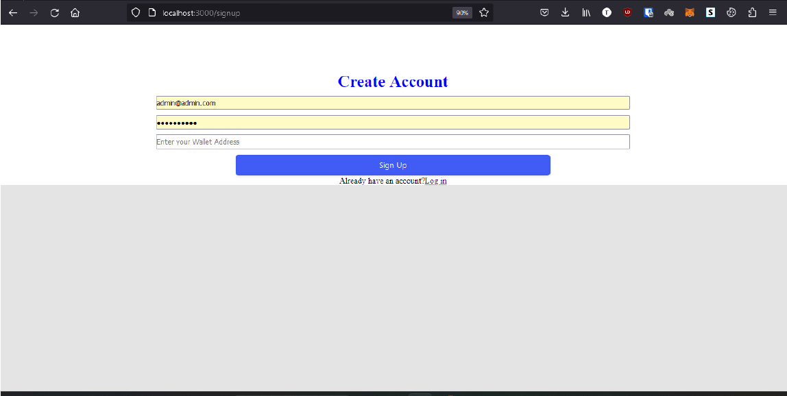
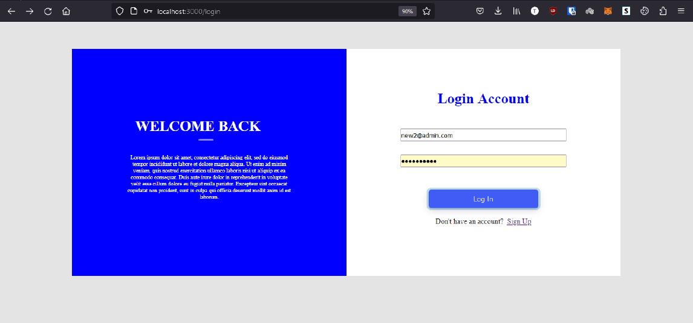
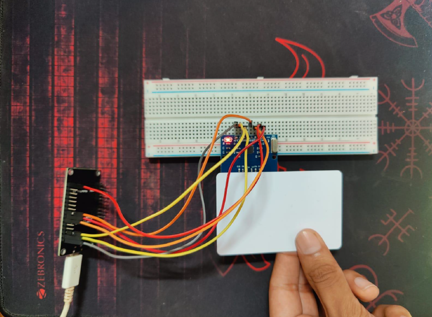
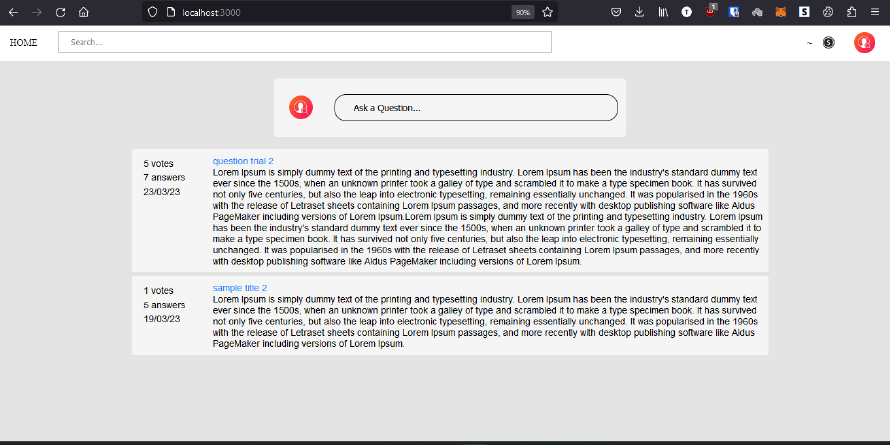
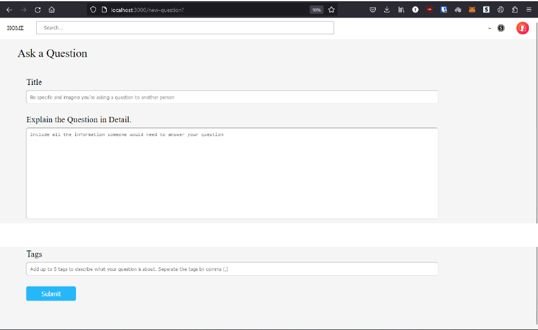
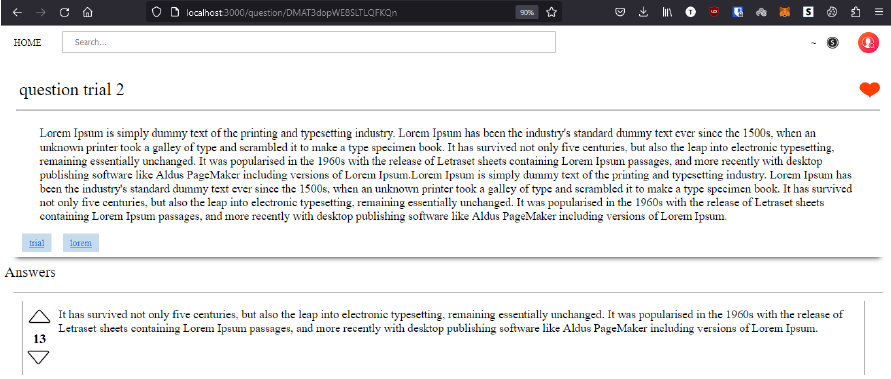
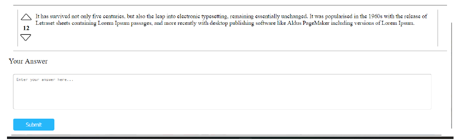
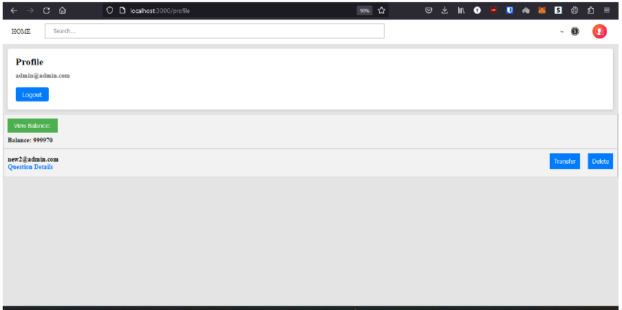

# Problem Solution Website

## Table of Contents

- [About](#about)
- [Features](#features)
- [Installation](#installation)
- [Screenshots](#screenshots)


## About

Our project is a website that serves as a platform for users to ask and answer questions on various topics. It works on a reward-based system where users who provide helpful answers are eligible for receiving tokens based on Ethereum's ERC-20 standard. The website is similar to Quora but with the added incentive of earning tokens. The website has a user-friendly interface and provides various features like asking and answering questions, upvoting and liking questions, searching for specific topics, and a user profile page. The platform's main aim is to provide a community-driven space where users can share their knowledge and earn rewards in return.

## Features

- Sign up page
- Login page
- RFID scan section
- Home page
- Add a question section
- Question page
- Profile page

## Installation

1. Clone the repository:

   ```bash
   git clone https://github.com/Adithya-M-Dileep/problem-solution
   ```
2. Install the dependencies:
   ```bash
   cd repository-name
   npm install
   ```
3. Set up the database and configure the necessary environment variables.
4. Start the server.
   ```bash
   npm start
   ```
## Screenshots


> Sign up page description


> Login page description


> RFID scan section description


> Home page description


> Add a question section description



> Question page description


> Profile page description

